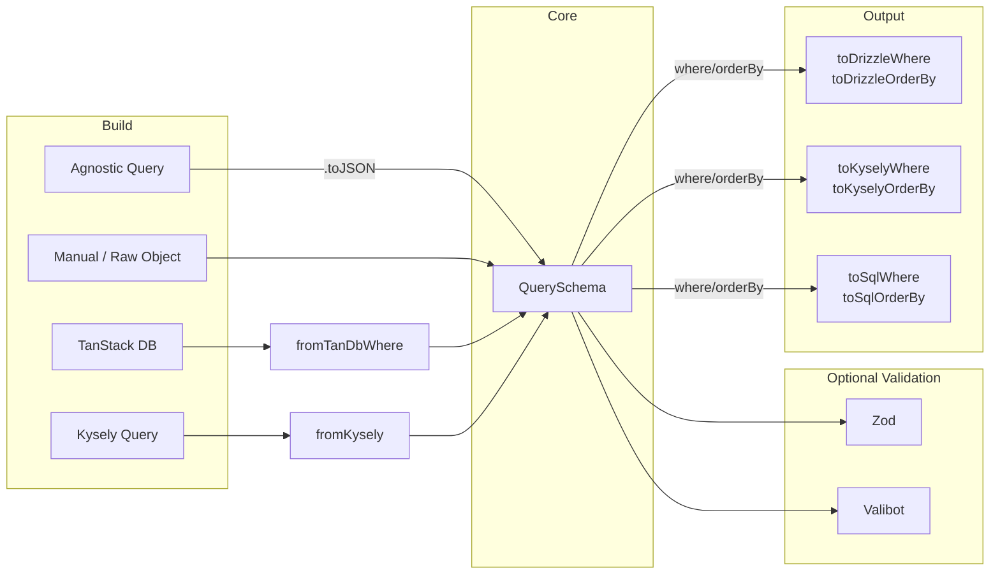

# Agnostic Query

Build portable `QuerySchema` objects with a type-safe fluent API, then convert to any ORM or raw SQL. Not an ORM replacement — just reduces the boilerplate of building, validating, and translating query conditions across the stack.

**Runtime-agnostic** — plain data that work in browsers, servers, and edge runtimes. Serialize to JSON, transmit over HTTP, consume on any platform.

**Database-agnostic** — the same `QuerySchema` drives Drizzle, Kysely, raw SQL (PostgreSQL), or any future adapter.


## Fluent Builder API

Use the `aq` builder to construct a `QuerySchema` with type-safe method chaining:

```ts
import { aq } from 'agnostic-query'

interface UserShape {
  name: string
  age: number
  status: string
  role: string
}

const schema = aq<UserShape>()
  .where('name', 'eq', 'Alice')
  .where('age', 'gte', 18)
  .where('status', 'in', ['active', 'pending'])
  .orderBy('name', 'asc')
  .limit(20)
  .offset(0)
  .toJSON()
// → {
//     where: {
//       op: 'and',
//       conditions: [
//         { field: ['name'], op: 'eq', value: 'Alice' },
//         { field: ['age'], op: 'gte', value: 18 },
//         { field: ['status'], op: 'in', values: ['active', 'pending'] },
//       ],
//     },
//     orderBy: [{ field: ['name'], direction: 'asc' }],
//     limit: 20,
//     offset: 0,
//   }
```

### Comparison operators

| Operator | Description |
|----------|-------------|
| `eq`     | Exact match |
| `gt`     | Greater than |
| `gte`    | Greater than or equal |
| `lt`     | Less than |
| `lte`    | Less than or equal |
| `like`   | SQL `LIKE` |
| `ilike`  | Case-insensitive `LIKE` |
| `in`     | Value in array (outputs `values` field) |

### Logical operators nesting (callbacks)

For complex logic (`and`, `or`, `not`), pass a callback to `.where()`:

```ts
const schema = aq<UserShape>()
  .where(({ or, where, not }) =>
    or([
      where('role', 'eq', 'admin'),
      where('role', 'eq', 'moderator'),
      not(where('status', 'eq', 'banned')),
    ]),
  )
  .toJSON()
// → {
//     where: {
//       op: 'or',
//       conditions: [
//         { field: ['role'], op: 'eq', value: 'admin' },
//         { field: ['role'], op: 'eq', value: 'moderator' },
//         { op: 'not', condition: { field: ['status'], op: 'eq', value: 'banned' } },
//       ],
//     },
//   }
```

### Tuple field paths

JSONB paths and array indices work the same as raw `QuerySchema`:

```ts
aq<UserShape>()
  .where(['address', 'city', 'name'], 'eq', 'Berlin')
  .where(['tags', 0, 'name'], 'like', '%tech%')
  .orderBy(['address', 'city', 'name'], 'desc')
```

### Raw `QueryWhere` object

Pass a pre-built `QueryWhere` directly to `.where()` — useful when reusing conditions from an existing schema or building programmatically:

```ts
const roleWhere: QuerySchema<UserShape>['where'] = {
  field: ['role'],
  op: 'eq',
  value: 'admin',
}

const schema = aq<UserShape>()
  .where('name', 'eq', 'Alice')
  .where(roleWhere)
  .toJSON()
// → {
//     where: {
//       op: 'and',
//       conditions: [
//         { field: ['name'], op: 'eq', value: 'Alice' },
//         { field: ['role'], op: 'eq', value: 'admin' },
//       ],
//     },
//   }
```

This also works inside callbacks for combining builder and raw conditions:

```ts
const schema = aq<UserShape>()
  .where(({ or, where }) =>
    or([where('name', 'eq', 'Alice'), where(roleWhere)]),
  )
  .toJSON()
// → {
//     where: {
//       op: 'or',
//       conditions: [
//         { field: ['name'], op: 'eq', value: 'Alice' },
//         { field: ['role'], op: 'eq', value: 'admin' },
//       ],
//     },
//   }
```

### Chaining `.orderBy()`

Multiple `.orderBy()` calls append entries:

```ts
aq<UserShape>()
  .orderBy('name', 'asc')
  .orderBy('age', 'desc')
  .toJSON()
// → {
//     orderBy: [
//       { field: ['name'], direction: 'asc' },
//       { field: ['age'], direction: 'desc' },
//     ],
//   }
```

## Type System

### Field path safety

```ts
interface User {
  name: string
  age: number
  tags: { id: number; name: string }[]
  address: { city: { name: string } }
}

aq<User>().where(['tags', 0, 'name'], 'eq', 'tech')         // ✓
aq<User>().where(['tags', 0, 'name'], 'eq', 42)              // ✗ string ≠ number
aq<User>().where(['address', 'city', 'name'], 'eq', 'Berlin') // ✓
aq<User>().where(['address', 'city', 'zip'], 'eq', '12345')   // ✗ no 'zip' on city
```

## Usage

```bash
bun add agnostic-query
```

Then install only the adapters you need:

```bash
# For runtime validation
bun add zod          # optional
bun add valibot      # optional

# For ORM adapters
bun add drizzle-orm  # optional
bun add @tanstack/query-db-collection  # optional

# For Kysely adapter
bun add kysely  # optional
```

### Import paths

```ts
// Core types & builder
import { aq, QuerySchema, QueryWhere, QueryOrderBy, findWhere, newComparisonWhere, newWhere } from 'agnostic-query'

// Zod validation
import { createWhereSchema } from 'agnostic-query/zod'

// Valibot validation
import { createWhereSchema } from 'agnostic-query/valibot'

// Drizzle adapter — apply where to Drizzle query
import { toDrizzle, toDrizzleWhere, toDrizzleOrderBy } from 'agnostic-query/drizzle/pg'

// db0 adapter — execute schema as parameterised SQL via db0
import { query } from 'agnostic-query/db0/pg'

// TanStack DB adapter — parse TanStack expression into QueryWhere
import { fromTanDbWhere, fromTanDbOrderBy } from 'agnostic-query/tanstack-db'

// Kysely adapter — bidirectional
import { fromKysely, toKyselyWhere, toKyselyOrderBy } from 'agnostic-query/kysely/pg'

// SQL adapter — parameterised SQL generation
import { toSql, toSqlWhere, toSqlOrderBy } from 'agnostic-query/sql/pg'
```

## Core Utilities

### Raw schema (without builder)

You can also construct `QuerySchema` as a plain object directly:

```ts
import type { QuerySchema } from 'agnostic-query'

interface UserShape {
  name: string
  age: number
  status: string
}

const schema: QuerySchema<UserShape> = {
  limit: 20,
  offset: 0,
  orderBy: [{ field: ['name'], direction: 'asc' }],
  where: {
    op: 'and',
    conditions: [
      { field: ['age'], op: 'gte', value: 18 },
      { field: ['status'], op: 'in', values: ['active', 'pending'] },
    ],
  },
}
```

### findWhere: search within a WHERE tree

Extract a specific condition from a complex nested WHERE tree:

```ts
import { findWhere } from 'agnostic-query'

const where = {
  op: 'and',
  conditions: [
    { field: ['name'], op: 'eq', value: 'Alice' },
    {
      op: 'or',
      conditions: [
        { field: ['age'], op: 'lt', value: 30 },
        { field: ['role'], op: 'eq', value: 'admin' },
      ],
    },
  ],
}

const searcher = findWhere(where)

searcher.find(['age'])            // { field: ['age'], op: 'lt', value: 30 }
searcher.find(['role'], 'eq')     // { field: ['role'], op: 'eq', value: 'admin' }
searcher.eq(['name'])             // { field: ['name'], op: 'eq', value: 'Alice' }
searcher.in(['role'])             // undefined
```

### newComparisonWhere: build a ComparisonWhere

Create a reusable `ComparisonWhere` object with full type inference:

```ts
import { newComparisonWhere } from 'agnostic-query'

interface User {
  name: string
  age: number
  status: string
  tags: { id: number; name: string }[]
}

const nameEq = newComparisonWhere<User>()('name', 'eq', 'Alice')
// → { field: ['name'], op: 'eq', value: 'Alice' }

const statusIn = newComparisonWhere<User>()('status', 'in', ['active', 'pending'])
// → { field: ['status'], op: 'in', values: ['active', 'pending'] }

const tagName = newComparisonWhere<User>()(['tags', 0, 'name'], 'like', '%tech%')
// → { field: ['tags', 0, 'name'], op: 'like', value: '%tech%' }
```

Pass the result directly to `.where()` on a builder or inside a callback:

```ts
const filter = aq<User>()
  .where(nameEq)
  .where(statusIn)
  .toJSON()
```

### newWhere: where-only builder

Build a `QueryWhere` independently of a full `QuerySchema` — useful when you want to construct, compose, and reuse where conditions in isolation:

```ts
import { newWhere } from 'agnostic-query'

const w = newWhere<User>()
  .where('name', 'eq', 'Alice')
  .where('age', 'gte', 18)
  .toJSON()
// → {
//     op: 'and',
//     conditions: [
//       { field: ['name'], op: 'eq', value: 'Alice' },
//       { field: ['age'], op: 'gte', value: 18 },
//     ],
//   }
```

Accepts an initial `QueryWhere` to extend, with all the same overloads as `aq().where()`:

```ts
const base = newWhere<User>({ field: ['status'], op: 'eq', value: 'active' })

const full = base
  .where(({ or, and, where }) =>
    or([
      and([where('role', 'eq', 'admin'), where('age', 'gte', 18)]),
      where('role', 'eq', 'moderator'),
    ]),
  )
  .toJSON()
```

Pass the result directly into `QuerySchema` or another `newWhere`:

```ts
const schema: QuerySchema<User> = {
  limit: 20,
  where: newWhere<User>()
    .where(fromTanDbWhere(where))
    .where(fromTanDbWhere(cursor?.whereFrom))
    .toJSON(),
  orderBy: fromTanDbOrderBy(orderBy),
}
```

### Complex field paths (JSONB / arrays)

```ts
// JSONB nested field → "address"->'city'->>'name' = ?
{ field: ['address', 'city', 'name'], op: 'eq', value: 'Berlin' }

// PG array element → "category"[1] = ?
{ field: ['category', 0], op: 'eq', value: 'electronics' }

// Nested array of objects → "tags"->0->>'name' LIKE ?
{ field: ['tags', 0, 'name'], op: 'like', value: '%tech%' }
```

All paths are fully type-checked against your shape.

## Adapter: Raw SQL (PostgreSQL)

```ts
import { toSql } from 'agnostic-query/sql/pg'

const { sql, params } = toSql({
  table: 'users',
  ...schema,
})!
// → sql:    SELECT * FROM "users" WHERE "age" >= ? AND "status" IN (?, ?) ORDER BY "name" ASC LIMIT 20 OFFSET 0
// → params: [18, 'active', 'pending']
```

Or compose the parts yourself using `toSqlWhere` / `toSqlOrderBy` for partial queries. Pass the resulting `{ sql, params }` to any driver that supports parameterised queries (node-postgres, postgres.js, db0, Bun, etc.).

## Adapter: Kysely

### Extract schema from a Kysely query

```ts
import { fromKysely } from 'agnostic-query/kysely/pg'

const query = db
  .selectFrom('user')
  .selectAll()
  .where('age', '>=', 18)
  .where('status', 'in', ['active', 'pending'])
  .orderBy('name', 'asc')
  .limit(20)

const schema = fromKysely(query)
// → {
//     limit: 20,
//     orderBy: [{ field: ['name'], direction: 'asc' }],
//     where: { op: 'and', conditions: [...] },
//   }

JSON.stringify(schema) // send to client
```

### Apply schema to a Kysely query

```ts
import { toKyselyWhere, toKyselyOrderBy } from 'agnostic-query/kysely/pg'

let query = db.selectFrom('user').selectAll()

if (schema.where)   query = query.where(toKyselyWhere(schema.where))
if (schema.orderBy) query = toKyselyOrderBy(query, schema.orderBy)
if (schema.limit)   query = query.limit(schema.limit)
if (schema.offset)  query = query.offset(schema.offset)

const users = await query.execute()
```

## Adapter: Drizzle

One-shot: build and execute the full query with `toDrizzle`:

```ts
import { toDrizzle } from 'agnostic-query/drizzle/pg'

const rows = await toDrizzle<User>(db, userTable, data)
```

Or compose manually for more control:

```ts
import { toDrizzleWhere, toDrizzleOrderBy } from 'agnostic-query/drizzle/pg'
import { and, eq } from 'drizzle-orm'

const conditions = [
  toDrizzleWhere(schema.user, data.where),
  eq(schema.user.orgId, currentOrgId),
].filter(Boolean)

const rows = await db
  .select()
  .from(schema.user)
  .where(and(...conditions))
  .orderBy(...toDrizzleOrderBy(schema.user, data.orderBy))
  .limit(data.limit ?? 50)
  .offset(data.offset ?? 0)
```

## End-to-end: aq → QuerySchema → HTTP → Drizzle

Browser code builds a query with the `aq` builder, serializes the `QuerySchema`, sends it to a server function, then executes via db0 with full type safety.

**Browser** (shared type from `#/features/project/project.schema`)

```ts
import { aq } from 'agnostic-query'
import type { Project } from '#/features/project/project.schema.ts'

const schema = aq<Project>({ table: 'project' })
  .where('age', 'gte', 18)
  .where('status', 'in', ['active', 'pending'])
  .orderBy('name', 'asc')
  .limit(20)
  .toJSON()

const projects = await listProject({ data: schema })
```

**Server**

Because `QuerySchema` is plain data, you can inject access control conditions before executing:

```ts
import { aq } from 'agnostic-query'
import { toDrizzle } from 'agnostic-query/drizzle/pg'
import { getCurrentUser } from '#/features/auth/auth.fn.ts'

export const listProject = createServerFn({ method: 'GET' })
  .handler(async ({ data }) => {
    const { userId } = getCurrentUser()

    // Inject tenant isolation — reuse aq builder with existing schema
    const enriched = aq(data).where('user_id', 'eq', userId).toJSON()

    return await toDrizzle(db, projectTable, data)
  })
```
### Data Flow




## Toolchain

- Package manager: **bun** (workspaces)
- Type checking: **tsgo** (TypeScript Go / TS 7.0 preview)
- Validation: **zod v4** / **valibot v1**

## Examples

```bash
cd examples/with-drizzle
bun start
```

```bash
cd examples/with-kysely
bun start
```
