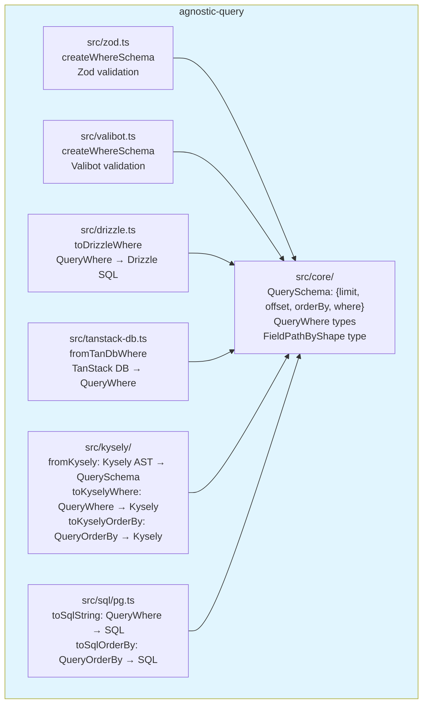
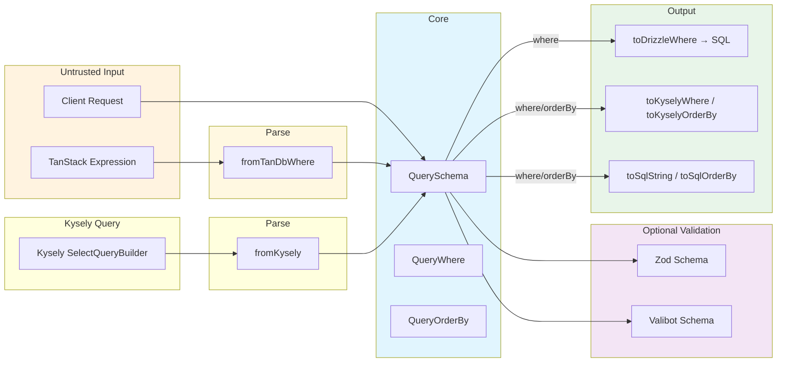
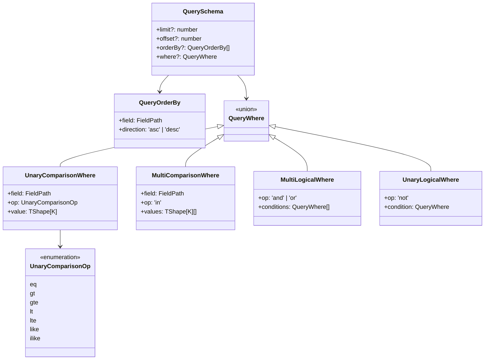

# Agnostic Query

**Runtime-agnostic** query schema — core types are plain data that work in browsers, servers, and edge runtimes. The same `QuerySchema` can be serialized (JSON), transmitted over HTTP, and consumed by any adapter on any platform.

**Database-agnostic** — the same `QueryWhere` / `QueryOrderBy` can drive Drizzle, Kysely, raw SQL (PostgreSQL), or any future adapter.

## Architecture



## Data Flow



## QuerySchema Structure



## Usage

```bash
bun add agnostic-query
```

Then install only the adapters you need:

```bash
# For runtime validation
bun add zod          # optional
bun add valibot      # optional

# For ORM adapters
bun add drizzle-orm  # optional
bun add @tanstack/query-db-collection  # optional

# For Kysely adapter
bun add kysely  # optional
```

### Import paths

```ts
// Core types
import { QuerySchema, QueryWhere, QueryOrderBy, findWhere } from 'agnostic-query'

// Zod validation
import { createWhereSchema } from 'agnostic-query/zod'

// Valibot validation
import { createWhereSchema } from 'agnostic-query/valibot'

// Drizzle adapter — apply where to Drizzle query
import { toDrizzleWhere } from 'agnostic-query/drizzle'

// TanStack DB adapter — parse TanStack expression into QueryWhere
import { fromTanDbWhere } from 'agnostic-query/tanstack-db'

// Kysely adapter — bidirectional
import { fromKysely, toKyselyWhere, toKyselyOrderBy } from 'agnostic-query/kysely'

// SQL adapter — parameterised SQL generation
import { toSqlString, toSqlOrderBy } from 'agnostic-query/sql'
```

## Toolchain

- Package manager: **bun** (workspaces)
- Type checking: **tsgo** (TypeScript Go / TS 7.0 preview)
- Validation: **zod v4** / **valibot v1**

## Examples

```bash
cd examples/with-drizzle
bun start
```

```bash
cd examples/with-kysely
bun start
```
