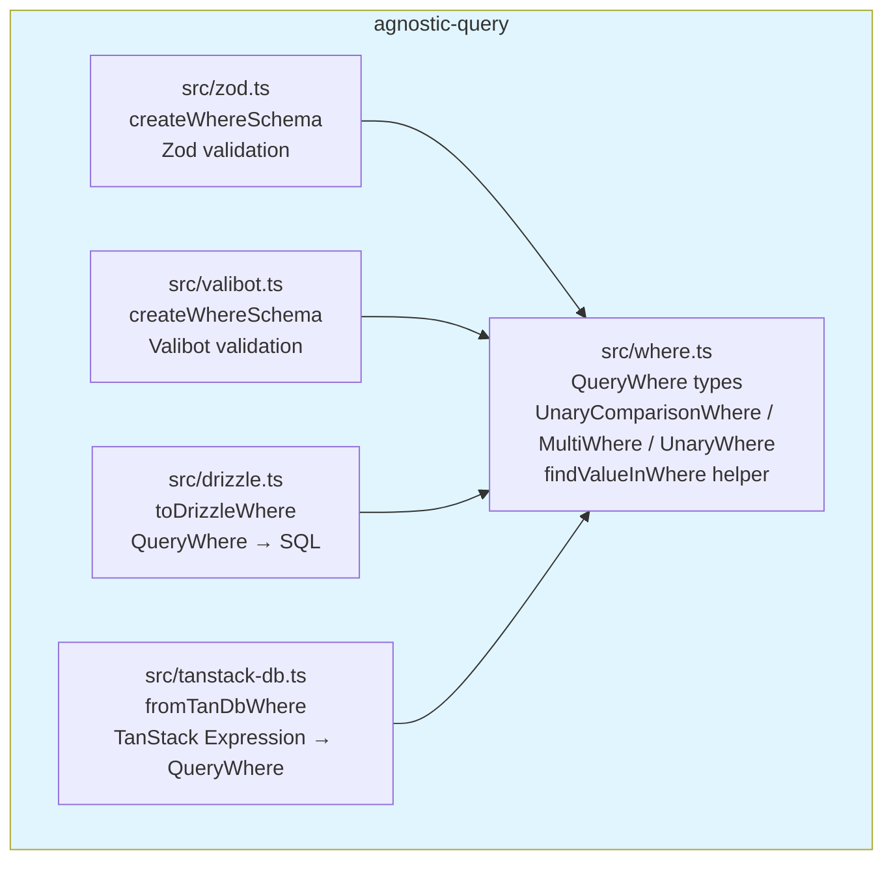
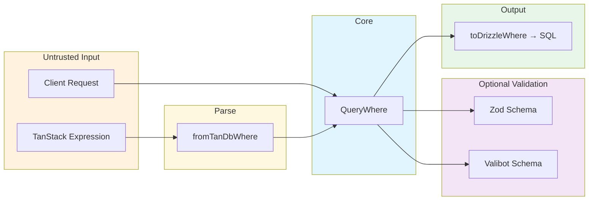
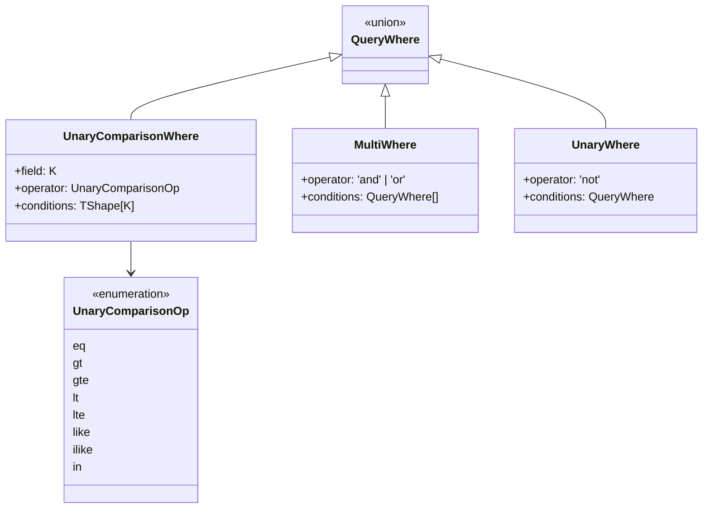

# Agnostic Query

Database-agnostic query condition library with type-safe WHERE clause definitions.

## Architecture



## Data Flow



## WHERE Condition Structure



## Usage

```bash
bun add agnostic-query
```

Then install only the adapters you need:

```bash
# For runtime validation
bun add zod          # optional
bun add valibot      # optional

# For ORM adapters
bun add drizzle-orm  # optional
bun add @tanstack/query-db-collection  # optional
```

### Import paths

```ts
// Core types
import { QueryWhere, findValueInWhere } from 'agnostic-query'

// Zod validation
import { createWhereSchema } from 'agnostic-query/zod'

// Valibot validation
import { createWhereSchema } from 'agnostic-query/valibot'

// Drizzle adapter
import { toDrizzleWhere } from 'agnostic-query/drizzle'

// TanStack DB adapter
import { fromTanDbWhere } from 'agnostic-query/tanstack-db'
```

## Toolchain

- Package manager: **bun** (workspaces)
- Type checking: **tsgo** (TypeScript Go / TS 7.0 preview)
- Validation: **zod v4** / **valibot v1**

## Examples

```bash
cd examples/with-drizzle
bun start
```
