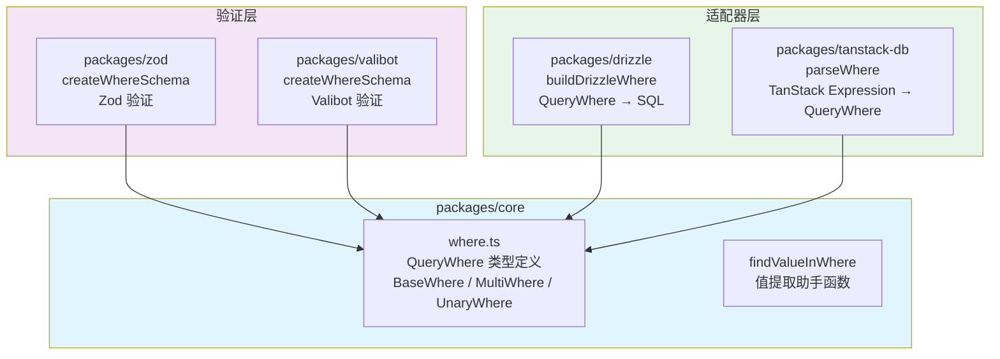
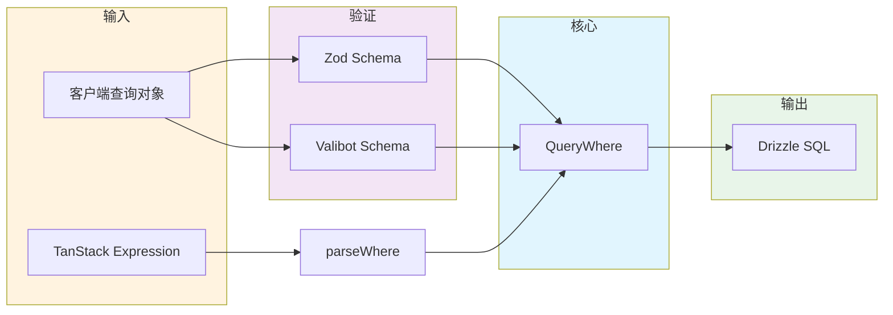
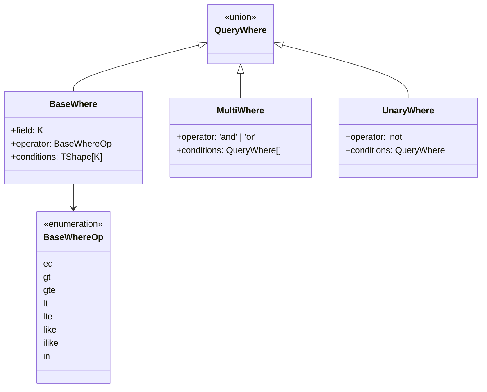

# Agnostic Query

数据库无关的查询条件库，提供类型安全的 WHERE 条件定义，可在不同 ORM/框架间通用。

## 架构



## 数据流



## WHERE 条件结构



## 包说明

| 包 | 描述 |
|---|---|
| `@agnostic-query/core` | 核心类型和操作符定义 |
| `@agnostic-query/zod` | Zod v4 运行时验证 Schema |
| `@agnostic-query/valibot` | Valibot 运行时验证 Schema |
| `@agnostic-query/drizzle` | Drizzle ORM 适配器：`QueryWhere → SQL` |
| `@agnostic-query/tanstack-db` | TanStack DB 适配器：`TanStack Expression → QueryWhere` |

## 工具链

- 包管理: **bun** (workspaces)
- 类型检查: **tsgo** (TypeScript Go / TS 7.0 preview)
- 验证库: **zod v4**

## 使用

```bash
bun install
```
