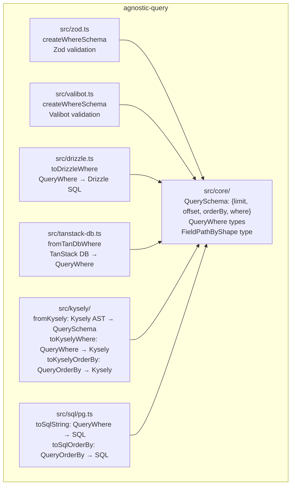
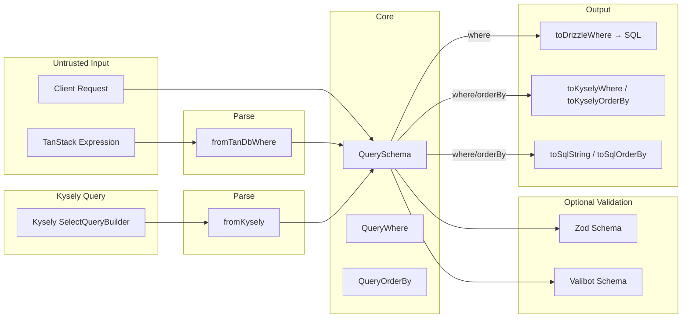
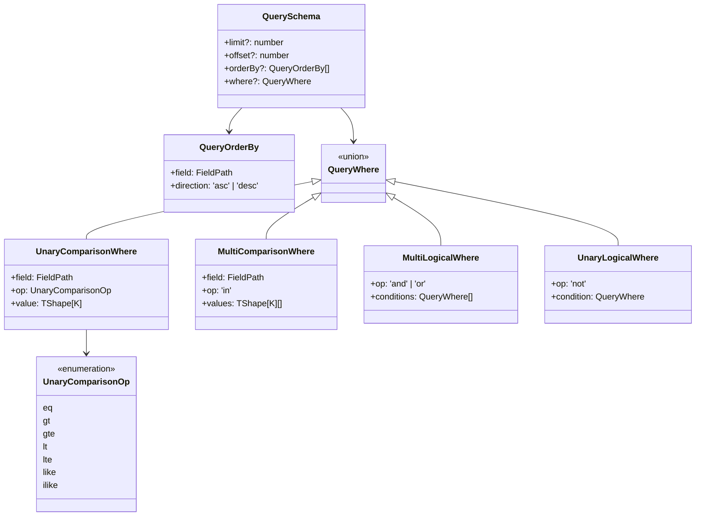

# Agnostic Query

**Runtime-agnostic** query schema — core types are plain data that work in browsers, servers, and edge runtimes. The same `QuerySchema` can be serialized (JSON), transmitted over HTTP, and consumed by any adapter on any platform.

**Database-agnostic** — the same `QueryWhere` / `QueryOrderBy` can drive Drizzle, Kysely, raw SQL (PostgreSQL), or any future adapter.

## Architecture



## Data Flow



## QuerySchema Structure



## Usage

```bash
bun add agnostic-query
```

Then install only the adapters you need:

```bash
# For runtime validation
bun add zod          # optional
bun add valibot      # optional

# For ORM adapters
bun add drizzle-orm  # optional
bun add @tanstack/query-db-collection  # optional

# For Kysely adapter
bun add kysely  # optional
```

### Import paths

```ts
// Core types
import { QuerySchema, QueryWhere, QueryOrderBy, findWhere } from 'agnostic-query'

// Zod validation
import { createWhereSchema } from 'agnostic-query/zod'

// Valibot validation
import { createWhereSchema } from 'agnostic-query/valibot'

// Drizzle adapter — apply where to Drizzle query
import { toDrizzleWhere } from 'agnostic-query/drizzle'

// TanStack DB adapter — parse TanStack expression into QueryWhere
import { fromTanDbWhere } from 'agnostic-query/tanstack-db'

// Kysely adapter — bidirectional
import { fromKysely, toKyselyWhere, toKyselyOrderBy } from 'agnostic-query/kysely'

// SQL adapter — parameterised SQL generation
import { toSqlString, toSqlOrderBy } from 'agnostic-query/sql'
```

## Usage Examples

### 1. Core: Build and send a QuerySchema

The core types are plain objects — no imports needed at runtime. Declare a shape type and the field paths are checked against it:

```ts
import type { QuerySchema } from 'agnostic-query'

// Declare your database shape — field paths are type-checked against it
interface UserShape {
  name: string
  age: number
  status: string
}

// Build a schema (e.g. from a search UI)
const schema: QuerySchema<UserShape> = {
  limit: 20,
  offset: 0,
  orderBy: [{ field: ['name'], direction: 'asc' }],
  where: {
    op: 'and',
    conditions: [
      { field: ['age'], op: 'gte', value: 18 },
      { field: ['status'], op: 'in', values: ['active', 'pending'] },
      // { field: ['address'], op: 'eq', value: 'x' },
      // → TS error! 'address' doesn't exist on UserShape
    ],
  },
}

// Serialise and send over HTTP
const res = await fetch('/api/users', {
  method: 'POST',
  body: JSON.stringify(schema),
  headers: { 'Content-Type': 'application/json' },
})
```

### 2. Raw SQL adapter (PostgreSQL)

On the server side, convert the received schema into parameterised SQL:

```ts
import { toSqlString, toSqlOrderBy } from 'agnostic-query/sql'

// schema = parsed from request body

const whereClause = toSqlString(schema.where)
// → { sql: '"age" >= ? AND "status" IN (?, ?)', params: [18, 'active', 'pending'] }

const orderByClause = toSqlOrderBy(schema.orderBy)
// → { sql: '"name" ASC', params: [] }

const sql = `
  SELECT * FROM users
  ${whereClause ? `WHERE ${whereClause.sql}` : ''}
  ${orderByClause ? `ORDER BY ${orderByClause.sql}` : ''}
  LIMIT ${schema.limit ?? 50} OFFSET ${schema.offset ?? 0}
`
// → sql:  SELECT * FROM users WHERE "age" >= ? AND "status" IN (?, ?) ORDER BY "name" ASC LIMIT 20 OFFSET 0
// → params: [18, 'active', 'pending']
```

### 3. Kysely adapter: extract schema from a query builder

If you already have a Kysely query, extract it into a portable `QuerySchema` for serialisation or inspection:

```ts
import { fromKysely } from 'agnostic-query/kysely'

const query = db
  .selectFrom('user')
  .selectAll()
  .where('age', '>=', 18)
  .where('status', 'in', ['active', 'pending'])
  .orderBy('name', 'asc')
  .limit(20)

const schema = fromKysely(query)
// → {
//     limit: 20,
//     orderBy: [{ field: ['name'], direction: 'asc' }],
//     where: {
//       op: 'and',
//       conditions: [
//         { field: ['age'], op: 'gte', value: 18 },
//         { field: ['status'], op: 'in', values: ['active', 'pending'] },
//       ],
//     },
//   }

// Send it to a client or to another service
JSON.stringify(schema)
```

### 4. Kysely adapter: apply schema to a query builder

The reverse: take a portable `QuerySchema` (from a client request, file, etc.) and apply it to a Kysely query:

```ts
import { toKyselyWhere, toKyselyOrderBy } from 'agnostic-query/kysely'

// schema = parsed from request body or other source

let query = db.selectFrom('user').selectAll()

// Apply WHERE
if (schema.where) {
  query = query.where(toKyselyWhere(schema.where))
}

// Apply ORDER BY
if (schema.orderBy) {
  query = toKyselyOrderBy(query, schema.orderBy)
}

// Apply LIMIT / OFFSET
if (schema.limit) query = query.limit(schema.limit)
if (schema.offset) query = query.offset(schema.offset)

const users = await query.execute()
```

### 5. findWhere: search within a WHERE tree

Extract a specific condition from a complex nested WHERE tree without manual traversal:

```ts
import { findWhere } from 'agnostic-query'

const where = {
  op: 'and',
  conditions: [
    { field: ['name'], op: 'eq', value: 'Alice' },
    {
      op: 'or',
      conditions: [
        { field: ['age'], op: 'lt', value: 30 },
        { field: ['role'], op: 'eq', value: 'admin' },
      ],
    },
  ],
}

const searcher = findWhere(where)

// Find condition by field name
const ageCondition = searcher.find(['age'])
// → { field: ['age'], op: 'lt', value: 30 }

// Find with specific operator
const adminCondition = searcher.find(['role'], 'eq')
// → { field: ['role'], op: 'eq', value: 'admin' }

// Shortcuts for common operators
const nameEq = searcher.eq(['name'])
// → { field: ['name'], op: 'eq', value: 'Alice' }

const rolesIn = searcher.in(['role'])
// → undefined (no 'in' condition on 'role')
```

### 6. Complex field paths (JSONB / arrays)

`FieldPath` supports nested objects and array subscripts — paths are plain tuples:

```ts
// JSONB nested field
{ field: ['address', 'city', 'name'], op: 'eq', value: 'Berlin' }
// → SQL: "address"->'city'->>'name' = ?

// PG array element
{ field: ['category', 0], op: 'eq', value: 'electronics' }
// → SQL: "category"[1] = ?

// Nested array of objects
{ field: ['tags', 0, 'name'], op: 'like', value: '%tech%' }
// → SQL: "tags"->0->>'name' LIKE ?
```

These paths are fully type-checked — TypeScript will reject a path that doesn't match the shape you declared.

### 7. End-to-end: Kysely → QuerySchema → HTTP → Zod → Drizzle

This example ties all adapters together — browser code uses Kysely to build a typed query, extracts it as `QuerySchema`, sends it to a TanStack Start server function, validates with Zod, then executes via Drizzle.

**Browser: build a Kysely query and extract QuerySchema**

```ts
// ~/features/users/-search.ts (browser)
import { fromKysely } from 'agnostic-query/kysely'
import type { QuerySchema } from 'agnostic-query'
import type { DB } from '~/db/types'

// Use Kysely to build a type-safe query — IDE autocompletion for fields
const q = db
  .selectFrom('user')
  .selectAll()
  .where('age', '>=', 18)
  .where('status', 'in', ['active', 'pending'])
  .orderBy('name', 'asc')
  .limit(20)

// Extract into a portable JSON-serialisable schema
const schema: QuerySchema<User> = fromKysely(q)
// => {
//   limit: 20,
//   orderBy: [{ field: ['name'], direction: 'asc' }],
//   where: {
//     op: 'and',
//     conditions: [
//       { field: ['age'], op: 'gte', value: 18 },
//       { field: ['status'], op: 'in', values: ['active', 'pending'] },
//     ],
//   },
// }

// Call the server function — TanStack Start serialises automatically
const users = await getUsers({ data: schema })
```

**Server: TanStack Start server function, validates with Zod, applies via Drizzle**

```ts
// ~/server/functions/users.fn.ts (server-only)
import { createServerFn } from '@tanstack/react-start'
import { createQuerySchema } from 'agnostic-query/zod'
import { toDrizzleWhere, toDrizzleOrderBy } from 'agnostic-query/drizzle'
import { and, eq } from 'drizzle-orm'
import * as schema from '~/db/schema'
import { getDb } from '~/server/db'

const { currentOrgId } = getSession()

export const getUsers = createServerFn({ method: 'GET' })
  .inputValidator(createQuerySchema<typeof schema.user.$inferSelect>())
  .handler(async ({ data }) => {
    const db = await getDb()

    const conditions = [
      toDrizzleWhere(schema.user, data.where),
      eq(schema.user.orgId, currentOrgId),   // tenant-scoping
    ].filter(Boolean)

    const rows = await db
      .select()
      .from(schema.user)
      .where(and(...conditions))
      .orderBy(...toDrizzleOrderBy(schema.user, data.orderBy))
      .limit(data.limit ?? 50)
      .offset(data.offset ?? 0)

    return rows
  })
```

## Toolchain

- Package manager: **bun** (workspaces)
- Type checking: **tsgo** (TypeScript Go / TS 7.0 preview)
- Validation: **zod v4** / **valibot v1**

## Examples

```bash
cd examples/with-drizzle
bun start
```

```bash
cd examples/with-kysely
bun start
```
