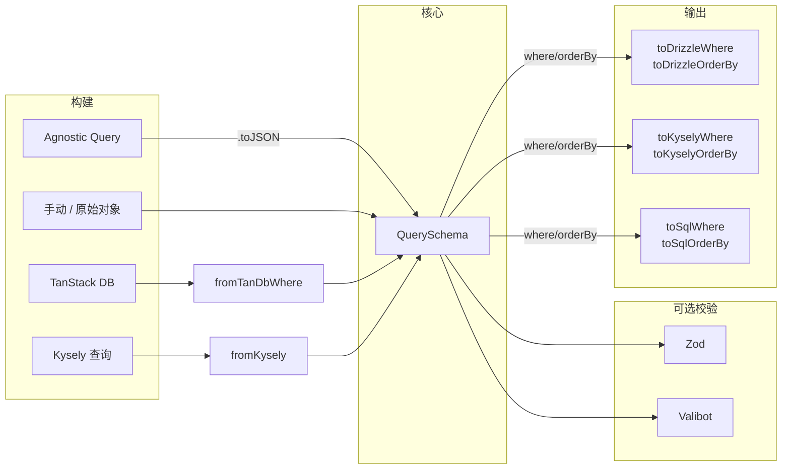

# Agnostic Query

使用类型安全的流式 API 构建可移植的 `QuerySchema` 对象，再转换为任意 ORM 或原生 SQL。不是 ORM 的替代品——只减少在全栈中构建、校验和翻译查询条件的样板代码。

**运行时无关** -- 纯数据，可在浏览器、服务端和边缘运行环境工作。序列化为 JSON，通过 HTTP 传输，在任何平台上消费。

**数据库无关** -- 同一个 `QuerySchema` 可驱动 Drizzle、Kysely、原生 SQL（PostgreSQL），或任何未来的适配器。

## 数据流



## 流式构建器 API

使用 `aq` 构建器通过类型安全的方法链构造 `QuerySchema`：

```ts
import { aq } from 'agnostic-query'

interface UserShape {
  name: string
  age: number
  status: string
  role: string
}

const schema = aq<UserShape>()
  .where('name', 'eq', 'Alice')
  .where('age', 'gte', 18)
  .where('status', 'in', ['active', 'pending'])
  .orderBy('name', 'asc')
  .limit(20)
  .offset(0)
  .toJSON()
// → {
//     where: {
//       op: 'and',
//       conditions: [
//         { field: ['name'], op: 'eq', value: 'Alice' },
//         { field: ['age'], op: 'gte', value: 18 },
//         { field: ['status'], op: 'in', values: ['active', 'pending'] },
//       ],
//     },
//     orderBy: [{ field: ['name'], direction: 'asc' }],
//     limit: 20,
//     offset: 0,
//   }
```

### 支持的操作符

| 操作符 | 说明 |
|----------|-------------|
| `eq`     | 精确匹配 |
| `gt`     | 大于 |
| `gte`    | 大于等于 |
| `lt`     | 小于 |
| `lte`    | 小于等于 |
| `like`   | SQL `LIKE` |
| `ilike`  | 大小写不敏感的 `LIKE` |
| `in`     | 值在数组中（输出 `values` 字段） |

### 逻辑嵌套（回调）

对于复杂逻辑（`and`、`or`、`not`），向 `.where()` 传入回调：

```ts
const schema = aq<UserShape>()
  .where(({ or, where, not }) =>
    or([
      where('role', 'eq', 'admin'),
      where('role', 'eq', 'moderator'),
      not(where('status', 'eq', 'banned')),
    ]),
  )
  .toJSON()
// → {
//     where: {
//       op: 'or',
//       conditions: [
//         { field: ['role'], op: 'eq', value: 'admin' },
//         { field: ['role'], op: 'eq', value: 'moderator' },
//         { op: 'not', condition: { field: ['status'], op: 'eq', value: 'banned' } },
//       ],
//     },
//   }
```

### 元组字段路径

JSONB 路径和数组索引与原始 `QuerySchema` 的用法一致：

```ts
aq<UserShape>()
  .where(['address', 'city', 'name'], 'eq', 'Berlin')
  .where(['tags', 0, 'name'], 'like', '%tech%')
  .orderBy(['address', 'city', 'name'], 'desc')
```

### 链式 `.orderBy()`

多次调用 `.orderBy()` 会追加条目：

```ts
aq<UserShape>()
  .orderBy('name', 'asc')
  .orderBy('age', 'desc')
  .toJSON()
// → {
//     orderBy: [
//       { field: ['name'], direction: 'asc' },
//       { field: ['age'], direction: 'desc' },
//     ],
//   }
```

## 类型系统

`aq` 构建器是一个**简化的 Kysely**——相同的流式风格、相同的操作符名，但生成可移植的 `QuerySchema` 数据而非 SQL AST。无需数据库连接。

### vs Kysely

| 方面 | Kysely | agnostic-query |
|--------|--------|----------------|
| 列引用 | `ReferenceExpression`（string \| `SqlBool`） | `FieldPathByShape` — 递归元组路径 |
| 操作符 | 每个操作符独立方法（`.where('col', '=', v)`） | 单一 `.where(col, op, value)`，按 `op` 判异 |
| `in` | `.where('col', 'in', arr)` | 语法相同，输出 `values` 字段 |
| 逻辑嵌套 | `.where((qb) => qb.where(...).orWhere(...))` | `.where(({ or, where }) => or([...]))` |
| 输出 | Kysely AST 节点 | 纯 JSON（`QuerySchema`） |
| 序列化 | 需自定义序列化器 | `JSON.stringify` 即可 |

### 字段路径安全

```ts
interface User {
  name: string
  age: number
  tags: { id: number; name: string }[]
  address: { city: { name: string } }
}

aq<User>().where(['tags', 0, 'name'], 'eq', 'tech')         // ✓
aq<User>().where(['tags', 0, 'name'], 'eq', 42)              // ✗ string ≠ number
aq<User>().where(['address', 'city', 'name'], 'eq', 'Berlin') // ✓
aq<User>().where(['address', 'city', 'zip'], 'eq', '12345')   // ✗ 不存在 'zip' 字段
```

## 安装

```bash
bun add agnostic-query
```

然后按需安装你需要的适配器：

```bash
# 运行时校验
bun add zod          # 可选
bun add valibot      # 可选

# ORM 适配器
bun add drizzle-orm  # 可选
bun add @tanstack/query-db-collection  # 可选

# Kysely 适配器
bun add kysely  # 可选
```

### 导入路径

```ts
// 核心类型和构建器
import { aq, QuerySchema, QueryWhere, QueryOrderBy, findWhere } from 'agnostic-query'

// Zod 校验
import { createWhereSchema } from 'agnostic-query/zod'

// Valibot 校验
import { createWhereSchema } from 'agnostic-query/valibot'

// Drizzle 适配器 — 将 where 应用到 Drizzle 查询
import { toDrizzle, toDrizzleWhere, toDrizzleOrderBy } from 'agnostic-query/drizzle'

// db0 适配器 — 通过 db0 以参数化 SQL 执行 schema
import { query } from 'agnostic-query/db0'

// TanStack DB 适配器 — 将 TanStack 表达式解析为 QueryWhere
import { fromTanDbWhere } from 'agnostic-query/tanstack-db'

// Kysely 适配器 — 双向转换
import { fromKysely, toKyselyWhere, toKyselyOrderBy } from 'agnostic-query/kysely'

// SQL 适配器 — 生成参数化 SQL
import { toSql, toSqlWhere, toSqlOrderBy } from 'agnostic-query/sql'
```

## 核心工具

### 原始 schema（不使用构建器）

你也可以直接构造纯对象形式的 `QuerySchema`：

```ts
import type { QuerySchema } from 'agnostic-query'

interface UserShape {
  name: string
  age: number
  status: string
}

const schema: QuerySchema<UserShape> = {
  limit: 20,
  offset: 0,
  orderBy: [{ field: ['name'], direction: 'asc' }],
  where: {
    op: 'and',
    conditions: [
      { field: ['age'], op: 'gte', value: 18 },
      { field: ['status'], op: 'in', values: ['active', 'pending'] },
    ],
  },
}
```

### findWhere：在 WHERE 树中搜索

从复杂的嵌套 WHERE 树中提取特定条件：

```ts
import { findWhere } from 'agnostic-query'

const where = {
  op: 'and',
  conditions: [
    { field: ['name'], op: 'eq', value: 'Alice' },
    {
      op: 'or',
      conditions: [
        { field: ['age'], op: 'lt', value: 30 },
        { field: ['role'], op: 'eq', value: 'admin' },
      ],
    },
  ],
}

const searcher = findWhere(where)

searcher.find(['age'])            // { field: ['age'], op: 'lt', value: 30 }
searcher.find(['role'], 'eq')     // { field: ['role'], op: 'eq', value: 'admin' }
searcher.eq(['name'])             // { field: ['name'], op: 'eq', value: 'Alice' }
searcher.in(['role'])             // undefined
```

### 复杂字段路径（JSONB / 数组）

```ts
// JSONB 嵌套字段 → "address"->'city'->>'name' = ?
{ field: ['address', 'city', 'name'], op: 'eq', value: 'Berlin' }

// PG 数组元素 → "category"[1] = ?
{ field: ['category', 0], op: 'eq', value: 'electronics' }

// 嵌套对象数组 → "tags"->0->>'name' LIKE ?
{ field: ['tags', 0, 'name'], op: 'like', value: '%tech%' }
```

所有路径都会根据你的数据形状进行完整的类型检查。

## 适配器：原生 SQL（PostgreSQL）

```ts
import { toSql } from 'agnostic-query/sql'

const { sql, params } = toSql({
  table: 'users',
  ...schema,
})!
// → sql:    SELECT * FROM "users" WHERE "age" >= ? AND "status" IN (?, ?) ORDER BY "name" ASC LIMIT 20 OFFSET 0
// → params: [18, 'active', 'pending']
```

也可以使用 `toSqlWhere` / `toSqlOrderBy` 自行组合部分查询。将得到的 `{ sql, params }` 传给任何支持参数化查询的驱动（node-postgres、postgres.js、db0、Bun 等）。

## 适配器：Kysely

### 从 Kysely 查询中提取 schema

```ts
import { fromKysely } from 'agnostic-query/kysely'

const query = db
  .selectFrom('user')
  .selectAll()
  .where('age', '>=', 18)
  .where('status', 'in', ['active', 'pending'])
  .orderBy('name', 'asc')
  .limit(20)

const schema = fromKysely(query)
// → {
//     limit: 20,
//     orderBy: [{ field: ['name'], direction: 'asc' }],
//     where: { op: 'and', conditions: [...] },
//   }

JSON.stringify(schema) // 发送给客户端
```

### 将 schema 应用到 Kysely 查询

```ts
import { toKyselyWhere, toKyselyOrderBy } from 'agnostic-query/kysely'

let query = db.selectFrom('user').selectAll()

if (schema.where)   query = query.where(toKyselyWhere(schema.where))
if (schema.orderBy) query = toKyselyOrderBy(query, schema.orderBy)
if (schema.limit)   query = query.limit(schema.limit)
if (schema.offset)  query = query.offset(schema.offset)

const users = await query.execute()
```

## 适配器：Drizzle

一步到位：使用 `toDrizzle` 构建并执行完整查询：

```ts
import { toDrizzle } from 'agnostic-query/drizzle/pg'

const rows = await toDrizzle<User>(db, userTable, data)
```

或手动组合以获得更多控制：

```ts
import { toDrizzleWhere, toDrizzleOrderBy } from 'agnostic-query/drizzle'
import { and, eq } from 'drizzle-orm'

const conditions = [
  toDrizzleWhere(schema.user, data.where),
  eq(schema.user.orgId, currentOrgId),
].filter(Boolean)

const rows = await db
  .select()
  .from(schema.user)
  .where(and(...conditions))
  .orderBy(...toDrizzleOrderBy(schema.user, data.orderBy))
  .limit(data.limit ?? 50)
  .offset(data.offset ?? 0)
```

## 端到端：aq → QuerySchema → HTTP → db0

浏览器端使用 `aq` 构建器构建查询，序列化 `QuerySchema` 后发送到服务端函数，然后通过 db0 执行，全程类型安全。

**浏览器端**（共享类型来自 `#/features/project/project.schema`）

```ts
import { aq } from 'agnostic-query'
import type { Project } from '#/features/project/project.schema.ts'

const schema = aq<Project>({ table: 'project' })
  .where('age', 'gte', 18)
  .where('status', 'in', ['active', 'pending'])
  .orderBy('name', 'asc')
  .limit(20)
  .toJSON()

const projects = await listProject({ data: schema })
```

**服务端**

因为 `QuerySchema` 是纯数据，你可以在执行前注入访问控制条件：

```ts
import { aq } from 'agnostic-query'
import { query } from 'agnostic-query/db0'
import { createDatabase } from 'db0'
import pg from 'db0/connectors/pg'
import { getCurrentUser } from '#/features/auth/auth.fn.ts'

const db = createDatabase(pg({ url: process.env.DATABASE_URL }))

export const listProject = createServerFn({ method: 'GET' })
  .handler(async ({ data }) => {
    const { userId } = getCurrentUser()

    // 注入租户隔离 — 复用 aq 构建器处理已有 schema
    const enriched = aq(data).where('user_id', 'eq', userId).toJSON()

    return await query(db, enriched)
  })
```

## 工具链

- 包管理器：**bun**（workspaces）
- 类型检查：**tsgo**（TypeScript Go / TS 7.0 preview）
- 校验：**zod v4** / **valibot v1**

## 示例

```bash
cd examples/with-drizzle
bun start
```

```bash
cd examples/with-kysely
bun start
```
