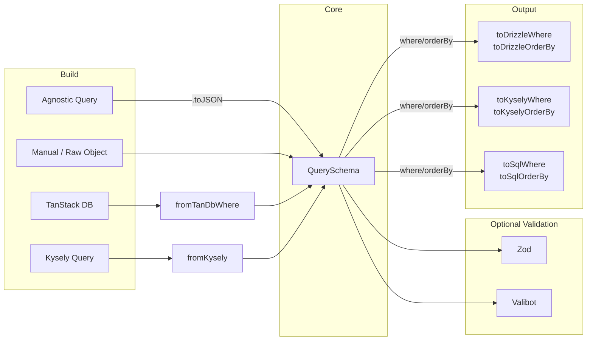

## aq → QuerySchema → HTTP → Drizzle

Client code builds a query with the `aq` builder, serializes the `QuerySchema`, and sends it to a server function.

**Client**

```ts
import { aq } from 'agnostic-query'
import type { Project } from '#/features/project/project.schema.ts'

const schema = aq<Project>({ table: 'project' })
  .where('age', 'gte', 18)
  .where('status', 'in', ['active', 'pending'])
  .orderBy('name', 'asc')
  .limit(20)
  .toJSON()

const projects = await listProject({ data: schema })
```

**Server**

Because `QuerySchema` is plain data, you can inject access control conditions before executing:

```ts
import { aq } from 'agnostic-query'
import { toDrizzle } from 'agnostic-query/drizzle/pg'
import { getCurrentUser } from '#/features/auth/auth.fn.ts'

export const listProject = createServerFn({ method: 'GET' })
  .handler(async ({ data }) => {
    const { userId } = getCurrentUser()

    const enriched = aq(data).where('user_id', 'eq', userId).toJSON()

    return await toDrizzle(db, projectTable, data)
  })
```

## TanStack DB + agnostic-query

Full-stack infinite query from the [`examples/tanstack-db`](https://github.com/Nahida-aa/agnostic-query/tree/main/examples/tanstack-db) project.

**Table schema** (`project.table.ts`)

```ts
import { integer, pgTable, text } from 'drizzle-orm/pg-core'
import { timeIdWithTimestamps } from '#/db/helpers.ts'

export const projectTable = pgTable('project', (t) => ({
  ...timeIdWithTimestamps,
  order: integer().default(0),
  name: text().notNull(),
}))
```

**Server function** (`project.fn.ts`)

```ts
import { createServerFn } from '@tanstack/react-start'
import { toDrizzle } from 'agnostic-query/drizzle/pg'
import { createQuerySchema } from 'agnostic-query/zod'
import { db } from '#/db/index.ts'
import type { Project } from '#/features/project/project.schmea.ts'
import { projectTable } from '#/features/project/project.table.ts'

export const listProject = createServerFn()
  .inputValidator(createQuerySchema<Project>())
  .handler(async ({ data }) => {
    return await toDrizzle(db, projectTable, data)
  })
```

**Client collection** (`project.sync.ts`)

```ts
import { queryCollectionOptions } from '@tanstack/query-db-collection'
import {
  BasicIndex,
  createCollection,
  type InitialQueryBuilder,
} from '@tanstack/db'
import { aq, newWhere, type QuerySchema } from 'agnostic-query'
import { fromTanDb } from 'agnostic-query/tanstack-db'
import { listProject } from '#/features/project/project.fn.ts'
import {
  type Project,
  projectSchema,
} from '#/features/project/project.schmea.ts'
import { getQueryClient } from '#/integrations/tanstack-query/provider'

export const projectCollect = createCollection(
  queryCollectionOptions({
    queryKey: ['project'],
    queryClient: getQueryClient(),
    schema: projectSchema,
    syncMode: 'on-demand',
    autoIndex: 'eager',
    defaultIndexType: BasicIndex,
    queryFn: async ({ meta }) => {
      const data = fromTanDb<Project>(meta?.loadSubsetOptions)
      return await listProject({ data })
    },
    getKey: (item) => item.id,
  }),
)

export const infiniteProjectQuery = (q: InitialQueryBuilder) =>
  q.from({ p: projectCollect }).orderBy(({ p }) => p.created_at, 'desc')
```

**Route** (`projects.tsx`)

```tsx
import { useLiveInfiniteQuery } from '@tanstack/db'
import { createFileRoute } from '@tanstack/react-router'
import { infiniteProjectQuery } from '#/features/project/project.sync.ts'

export const Route = createFileRoute('/projects')({
  component: RouteComponent,
})

function RouteComponent() {
  const { data, fetchNextPage, hasNextPage, isFetchingNextPage } =
    useLiveInfiniteQuery(infiniteProjectQuery, { pageSize: 10 })

  return (
    <div>
      {data?.map((p) => (
        <div key={p.id}>
          <h2>{p.name}</h2>
          <p>{p.created_at?.toLocaleString()}</p>
        </div>
      ))}
      {hasNextPage && (
        <button onClick={() => fetchNextPage()} disabled={isFetchingNextPage}>
          {isFetchingNextPage ? 'Loading...' : 'Load More'}
        </button>
      )}
    </div>
  )
}
```

## Data Flow


